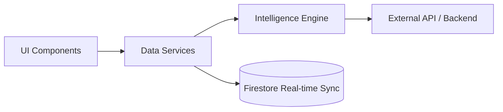

# CricOres Frontend: Premium Cricket Analytics Dashboard

A high-performance, real-time dashboard built for the modern cricket fan. CricOres delivers deep match insights, fantasy team optimization, and predictive analytics through a sleek, production-grade interface.

## 🌟 Overview
CricOres transforms raw cricket data into actionable intelligence. Built with **React** and **Next.js** principles, the platform focuses on real-time UI updates, seamless navigation, and data-driven decision-making for fans and fantasy players.

## 🏗️ Technical Architecture
The frontend is built on a service-oriented architecture, decoupling UI components from data fetching logic.



### Tech Stack
- **Framework**: React / Next.js (Web) & Expo (Mobile)
- **State Management**: React Context API & Hooks
- **Styling**: Modern CSS3 / Tailwind-inspired Design System
- **Real-time**: Google Firestore SDK
- **Icons/UI**: Lucide React & Custom SVG Assets

## ⚡ Key Features & Engineering
### 🎨 Real-time UI Rendering
Uses optimized React hooks to listen to Firestore updates and backend streams, ensuring "Ball-by-Ball" commentary and score updates without full-page reloads.

### 🧠 Intelligence Engine
A custom utility layer that calculates:
- **Win Probability**: Dynamic meters based on venue history and current run rate.
- **Fantasy Optimizer**: Algorithmic selection of captains/vice-captains based on recent form.
- **Turning Points**: Identifying critical match moments using statistical variance.

### 🔒 Secure Configuration
Implemented a strict `.env` strategy to decouple API endpoints from the source code, preventing security leaks while allowing seamless environment switching (Dev/Staging/Prod).

## 🛠️ Production Learnings & Challenges
- **API Rate Limit Handling**: To avoid redundant hits to the backend, we implemented a sophisticated `matchService` that debounces requests and leverages local storage for non-critical data.
- **Error Boundaries**: Implemented robust error handling to gracefully handle API timeouts or malformed data packets from third-party sources.
- **Debug Experience**: Built a dedicated `mockData` toggle allowed the team to iterate on UI/UX even when offline or when API credits were exhausted.

## 📂 Folder Structure
```text
cricores-frontend/
├── components/          # Reusable UI primitives (Buttons, Cards, Meters)
├── screens/             # Page/View containers (Dashboard, Tracker, Fantasy)
├── services/            # API integration, Firebase config, & Match logic
├── utils/              # Calculation engines & String helpers
├── constants/           # Colors, Layout constants, and Static data
├── .env.example         # Template for environment variables
└── README.md            # Project documentation
```

## ⚙️ Local Development
1. **Clone the repo**
2. **Setup Environment**:
   ```bash
   cp .env.example .env
   # Fill in your Firebase and Backend URL details
   ```
3. **Install & Run**:
   ```bash
   npm install
   npm run web # For Web development
   # OR
   npm start # For Expo development
   ```

## 📈 Engineering Highlights for Recruiters
- **Scalability**: Decoupled services allow the app to swap backend providers with zero changes to UI components.
- **Data Modeling**: Integrated Firestore with a structured schema for user predictions and caching.
- **Performance**: Optimized rendering cycles using `React.memo` and efficient dependency arrays in `useEffect`.
```

---
*Developed with production-level standards for the global cricket community.*
